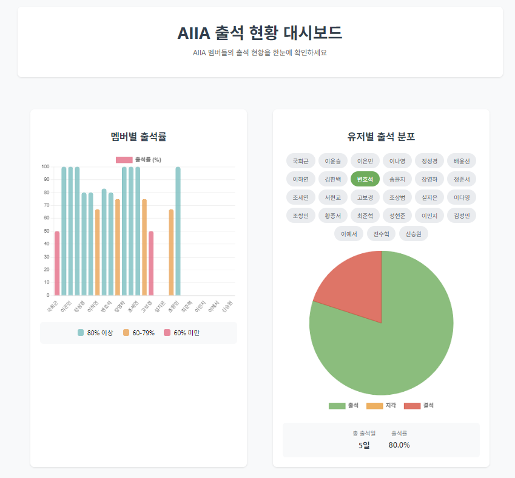
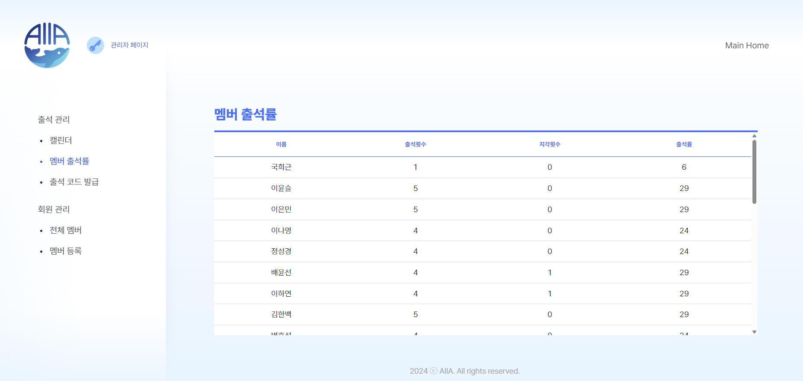

# AIIA Attendance

A page that visually displays AIIA's attendance rates.



## About AIIA AIR

This dashboard is integrated with [AIIA AIR](https://new.aiia-gcu.com), our club's official attendance management and schedule management system. AIIA AIR features:

- Attendance code system for real-time attendance tracking
- Admin-based attendance code generation
- Time-limited attendance submission
- Club schedule management
- Member management



## Features

- Real-time attendance rate data display
- Responsive design for mobile/desktop
- Intuitive UI/UX
- Real-time data updates
- Interactive bar chart showing attendance rates for all members
- Detailed pie chart for individual member attendance distribution
- Detailed tooltips with attendance statistics

## Tech Stack

- React.js
- Chart.js
- Axios
- CSS3

## Installation and Setup

1. Clone the repository
```bash
git clone [repository-url]
cd aiia-chart
```

2. Install dependencies
```bash
npm install
```

3. Environment Setup
This project requires a `.env` file to run properly. Please contact the repository owner to get the necessary environment variables.
AIR's REST API is secured

5. Start development server
```bash
npm start
```

5. Build
```bash
npm run build
```

## Chart Features

### Bar Chart
- Visualizes attendance rates for all members
- Color-coded based on attendance rate:
  - 🔵 Sky Blue: 80% and above
  - 🟠 Orange: 60-79%
  - 🔴 Red: Below 60%

### Pie Chart
- Shows attendance distribution for selected member
- Displays:
  - Attendance count
  - Late count
  - Absence count
- Includes percentage calculations
- Total attendance days and rate

## Project Structure

```
src/
  ├── components/     # Chart components
  │   ├── BarChart.js
  │   └── PieChart.js
  ├── img/           # Image assets
  ├── App.js         # Main application component
  ├── App.css        # Main styles
  ├── index.js       # Entry point
  └── index.css      # Global styles
```
